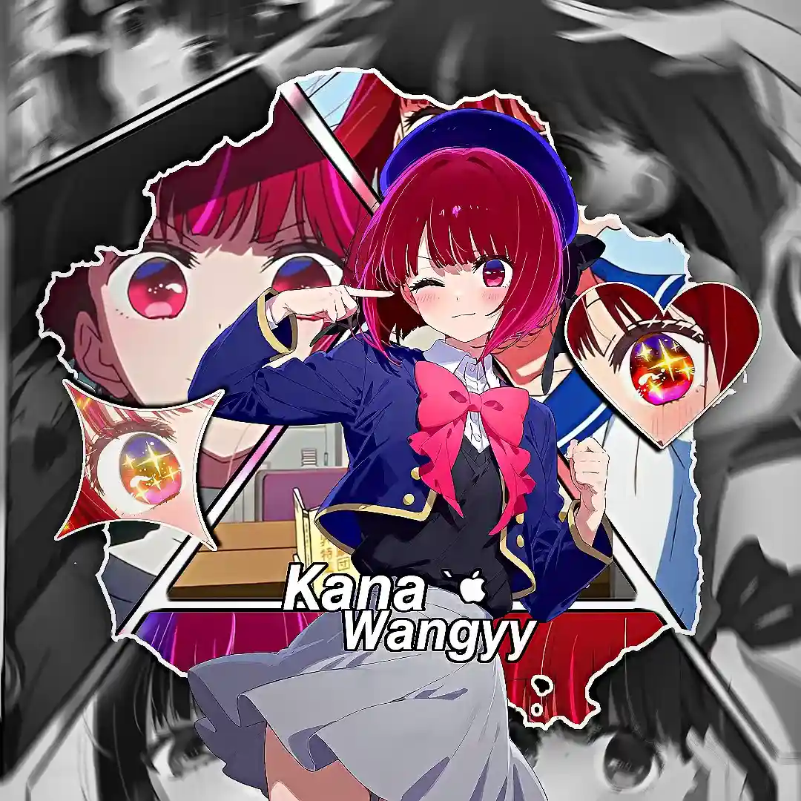

<div align="center">

# 🎌 AniZone 2026

### Modern Anime Streaming Platform Indonesia

> Fast. Clean. Responsive. Installable.  
> Dibuat untuk para wibu yang hidupnya setengah anime, setengah bug fixing.

<br>



<br><br>


<br>

Anime streaming platform powered by **Samehadaku Scraper** + **MyAnimeList API**.  
Built with pure chaos, caffeine, insomnia, and questionable life choices.

</div>

---

# 🧠 What is AniZone?

AniZone adalah platform streaming anime modern berbasis web yang fokus ke performa, tampilan clean, dan pengalaman pengguna yang gak bikin pengen banting monitor.

Project ini dibuat karena kebanyakan website anime sekarang:
- penuh iklan judi
- player lemot
- UI kek hasil copy paste 2017
- scroll dikit disuruh close popup 18 kali

Peradaban manusia gagal total.

Jadi lahirlah AniZone.

Menggunakan:
- 🔥 Samehadaku Scraper
- 📖 MyAnimeList API
- ⚡ Vanilla JS (modular)
- ☁️ Firebase Auth + Firestore
- 🐘 PHP optional backend
- 🧠 sedikit kewarasan developer yang tersisa

---

# ✨ Features

## 🎥 Anime Streaming
Streaming anime subtitle Indonesia dengan source otomatis. Multi-server support dengan pilihan server cadangan.

---

## 🔍 Fast Anime Search
Cari anime dengan cepat tanpa loading 3 generasi.

---

## 📈 Trending Anime
Realtime trending anime dari MyAnimeList.

Biar bisa ikut nonton anime mainstream sambil pura-pura bilang:
> "gw beda dari yang lain"

---

## 📅 Anime Schedule
Jadwal anime seasonal realtime dikelompokkan per hari tayang.

Karena manusia modern perlu sistem untuk mengatur jadwal nangis mingguan.

---

## 📰 Anime News
Update berita anime terbaru dari Anime News Network.

---

## 📖 MAL Synopsis Integration
Auto fetch synopsis, score, dan metadata dari MyAnimeList API.

---

## 👤 Authentication System
Firebase authentication — login via email atau Google.

---

## 👤 User Profile
Edit nama, bio, avatar, dan banner profil. Tersimpan di Firestore.

---

## 💕 Waifu List & Anime Favorit
Simpan waifu favorit dan list anime favorit di profil kamu. Data dari Jikan API (MAL).

---

## 🛠️ Admin Dashboard
Panel admin buat manage sistem dan konten.

---

## 📱 Progressive Web App (PWA)
Bisa diinstall kayak aplikasi native di HP maupun desktop.

---

## 🌙 Dark / Light Mode
Toggle tema gelap dan terang. Preferensi tersimpan di localStorage.

---

## ☁️ Deploy Ready
Support Railway, Vercel, Docker, dan VPS.

---

## 🐘 Optional PHP Backend
Ada PHP backend alternatif untuk shared hosting atau deployment ringan.

---

# 🧱 Tech Stack

| Category | Technology |
|---|---|
| Frontend | HTML5, CSS3, Vanilla JS (modular) |
| Backend | Node.js, Express |
| Database | Firebase Firestore |
| Authentication | Firebase Auth |
| Anime Source | Samehadaku Scraper |
| Anime Metadata | MyAnimeList API v2 + Jikan API |
| PHP Backend | PHP 8+ (opsional) |
| Deployment | Railway / Vercel / Docker |
| Developer Mental State | Critical |

---

# 📂 Project Structure

```
anizone/
├── api/
│   ├── config.js          ← Konstanta: URL, proxy, headers
│   ├── index.js           ← Entry point: Express routes + server
│   └── services/
│       ├── scraper.js     ← Semua logic scraping samehadaku
│       └── mal.js         ← Integrasi MAL API + berita
│
├── docker/
│   ├── nginx.conf
│   └── start.sh
│
├── php/
│   └── api/
│       ├── config.php
│       ├── anime.php
│       ├── favorites.php
│       ├── firebase.php
│       └── users.php
│
├── public/
│   ├── css/
│   │   ├── style.css      ← Styling utama
│   │   ├── login.css
│   │   └── admin.css
│   ├── js/
│   │   ├── auth.js        ← Firebase init, profil, waifu list
│   │   ├── login.js
│   │   ├── admin.js
│   │   ├── crud.js
│   │   └── modules/       ← Modul app utama
│   │       ├── config.js      ← Konstanta frontend (API_BASE, sections, genres)
│   │       ├── utils.js       ← Helper: show/hide/loader/emptyState
│   │       ├── theme.js       ← Dark/light mode + dropdown settings
│   │       ├── firestore.js   ← History & favorites
│   │       ├── home.js        ← Beranda, slider, trending, jadwal, berita
│   │       ├── anime.js       ← Kategori, detail, tonton, pencarian
│   │       ├── developer.js   ← Tab developer
│   │       └── navigation.js  ← switchTab(), init app
│   ├── index.html
│   ├── login.html
│   ├── admin.html
│   ├── manifest.json
│   ├── sw.js
│   ├── bg.webp
│   └── pp.webp
│
├── Dockerfile
├── package.json
├── railway.toml
├── STRUKTUR.md            ← Penjelasan detail refactoring
└── README.md
```

---

# ⚙️ Installation

## 📥 Clone Repository

```bash
git clone https://github.com/kanawangyy-yoikage/anizone.git
cd anizone
```

---

## 📦 Install Dependencies

```bash
npm install
```

---

## 🔑 Environment Variables

Buat file `.env`:

```env
MAL_CLIENT_ID=your_myanimelist_client_id
```

Dapatkan API key di:

```
https://myanimelist.net/apiconfig
```

> `MAL_CLIENT_ID` opsional — jika tidak diset, data trending dan jadwal menggunakan fallback scraping.

---

## 🚀 Run Development Server

```bash
npm run dev
```

Buka browser:

```
http://localhost:3000
```

---

# 🐘 PHP Module (Opsional)

Backend alternatif untuk shared hosting.

```bash
cd php
php -S localhost:8000
```

Environment variables yang dibutuhkan (set di Railway atau `.env`):

```env
FIREBASE_PROJECT_ID=your_project_id
FIREBASE_API_KEY=your_api_key
```

---

# ☁️ Deploy ke Railway

1. Push repo ke GitHub
2. Buka [railway.app](https://railway.app) → New Project → Deploy from GitHub
3. Set environment variable `MAL_CLIENT_ID`
4. Done

---

# 🐳 Docker

```bash
# Build
docker build -t anizone .

# Run
docker run -p 3000:3000 -e MAL_CLIENT_ID=your_key anizone
```

---

# 📡 API Endpoints

| Endpoint | Deskripsi |
|---|---|
| `GET /api/latest?page=1` | Daftar anime terbaru |
| `GET /api/search?q=naruto` | Cari anime |
| `GET /api/detail?url=...` | Detail anime + episode list |
| `GET /api/watch?url=...` | Stream URL + download links |
| `GET /api/trending` | Anime trending dari MAL |
| `GET /api/schedule` | Jadwal rilis musim ini |
| `GET /api/news` | Berita anime terbaru |
| `GET /api/mal/anime?title=...` | Data MAL (score, synopsis) |
| `GET /api/health` | Health check |

---

# 🔥 Roadmap

- [ ] Multi server streaming
- [ ] Continue watching
- [ ] Offline caching
- [ ] Mobile app version
- [ ] Recommendation AI
- [ ] Discord RPC integration
- [ ] Mengurangi penderitaan developer sebesar 1%

---

# 🛡️ Disclaimer

AniZone tidak meng-host video apapun.

Semua konten berasal dari pihak ketiga.

Project ini dibuat untuk tujuan edukasi dan eksperimen.

Support anime official kalau mampu. Studio anime sudah cukup menderita.

---

# 👑 Author

Made with caffeine, insomnia, seasonal anime addiction, dan keyboard abuse.

**Caliph / kanawangyy-yoikage**

```
https://github.com/kanawangyy-yoikage
```

WhatsApp Channel:
```
https://whatsapp.com/channel/0029VbB3bZLAO7RPl6shiI2C
```

---

# ⭐ Support

Kalau project ini membantu:

- ⭐ Star repository ini
- 🍴 Fork repository ini
- 📢 Share ke sesama wibu
- ☕ Minum air putih
- 💤 Tidur sesekali

---

# 📜 License

Licensed under MIT License.

Bebas dipakai, dimodif, dan didistribusi. Asal license aslinya tetap dicantumkan.

Open source adalah cara manusia berbagi penderitaan secara efisien.
